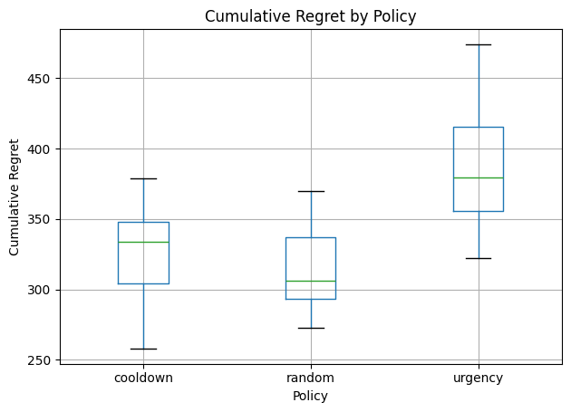

<!-- Q and A
Everything depends on tolerance, but how will we get this quantity in a real world data set. -->

# Capacity-Constrained Support Prioritization

## Problem
Customer support teams operate under strict capacity limits: each week only a fixed number of cases can be reviewed.  
Mis-prioritization creates long-term customer harm that is not immediately visible.

This project studies how different prioritization policies behave under capacity constraints when true customer tolerance is unobservable.

## System Overview
- Customers have a hidden tolerance level (ground truth)
- Tolerance decays when ignored and partially recovers when reviewed
- The system does NOT observe tolerance
- Only noisy behavioral signals are available:
  - time gap between messages
  - change in gap
  - worsening streak
- Reviewing a customer changes future behavior, corrupting labels

A multi-week simulation models these dynamics.

## Baseline Policies
- **Random**: uniformly selects cases
- **Urgency**: prioritizes customers with worsening communication behavior

## Evaluation Metric
Cumulative regret:
customers whose tolerance drops below a threshold while not being reviewed.

## Results
Across 30 independent simulations:

| Policy  | Mean Regret | Std |
|---------|-------------|-----|
| Random  | 314.00 | 27.66 |
| Cooldown | 328.97 | 29.10 |
| Urgency | 384.30 | 40.06 |

## Failure Analysis
Naive urgency prioritization consistently underperforms random selection.

Urgency focuses on already deteriorating customers, monopolizing limited capacity.  
Quiet customers decay without being noticed, increasing total system regret.

This is a structural failure caused by greedy, reactive decision-making under capacity constraints.

## Phase 6: Cooldown Extension
A simple cooldown mechanism prevents reviewing the same customer in consecutive weeks by temporarily penalizing their urgency score.

This forces attention to rotate across customers while still respecting urgency signals.

The cooldown policy significantly reduces the failure of naive urgency and achieves performance comparable to random selection without discarding signal-based prioritization.

## Limitations
- Random selection sometimes outperforms cooldown
- Cooldown is heuristic and not optimal
- Results depend on simulator assumptions

## Key Insight
Greedy prioritization fails under capacity constraints.  
Small structural constraints can stabilize decision systems even when true state is hidden.

## Repository Structure
See folders for decisions,simulation, evaluation.
